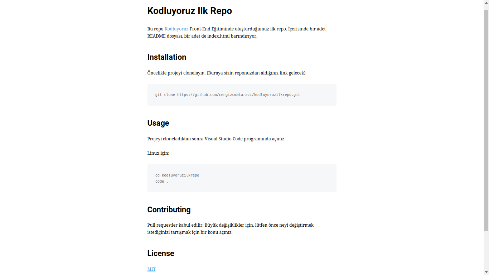

# Kodluyoruz Ilk Repo
Bu repo [Kodluyoruz](https://www.kodluyoruz.org) Front-End Eğitiminde oluşturduğumuz ilk repo. İçerisinde bir adet README dosyası, bir adet de index.html barındırıyor.  

 
 ## Installation
 Öncelikle projeyi clonelayın. (Buraya sizin reponudan aldığınız link gelecek)

 ```bash
 https://github.com/ayseoozel/kodluyoruzilkrepo
 ```
## Usage
Projeyi Cloneladıktan sonra VScode programında açınız.

Linux için:
```linux
cd kodluyoruzilkrepo
code .
```
## Contributing
Pull requestler kabul edilir. Büyük değişiklikler için, lütfen önce neyi değiştirmek istediğinizi tartışmak için bir konu açınız.

## License
[MIT](https://choosealicense.com/licenses/mit/)
